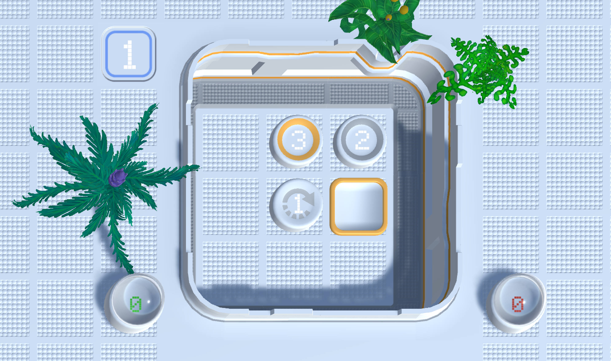

# ML-Agent Challenge: ScifiButtons
This is CouchFoxs repo for the [unity ml-agent challenge](https://connect.unity.com/challenges/ml-agents-1?_ga=2.261068109.1978306304.1516962394-1084077767.1386097858)

## Setup

## To play yourself:
* Find the Academy in the hierarchy
  * set the 'Wait Time' to 0
  * set the lessonNr-Key to 1, 2, 3 or 4
* Find the Brain underneath
  * change the brain-type to 'Player'

## To let the agent play:
* Find the Academy in the hierarchy
  * set the 'Wait Time' to 0.5 (or higher if it is to fast to follow)
  * set the lessonNr-Key to 1, 2, 3 (the brain hasn't been trained on 4 and is utterly useless)
* Find the Brain underneath
  * change the brain-type to 'Internal'
  * pick either the zero-brain or hero-brain as brain

## Setup for training:
* unzip python/scifibuttons.zip
* Find the Academy in the hierarchy
  * set the 'Wait Time' to 0
  * set Max Steps to 1000
* Find the Brain underneath
  * change the brain-type to 'External'
* Find the BoardAgent in the hierarchy
  * set Max Steps to 1000
